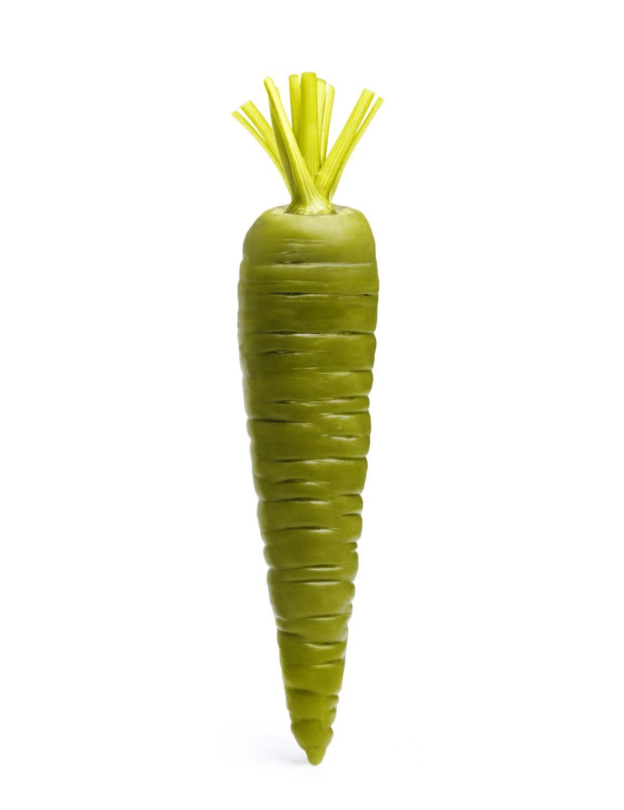

## Green Carrot!
- Make a Green Carrot!.
> 

## Microsoft Logo
- Microsoft logo design using **opencv** and **Numpy** library.
> 
## rubik
- fix rubik's colors.
> 

## Webcam Color Detection
- Real-time webcam color detection using **opencv**, **Numpy**.
- colors: white, black, gray, red, green, blue, cyan, magenta, yellow
> 

## Color Picker
- Simple RGB color picker written in python using **QT** & **pyside6**.
> 

